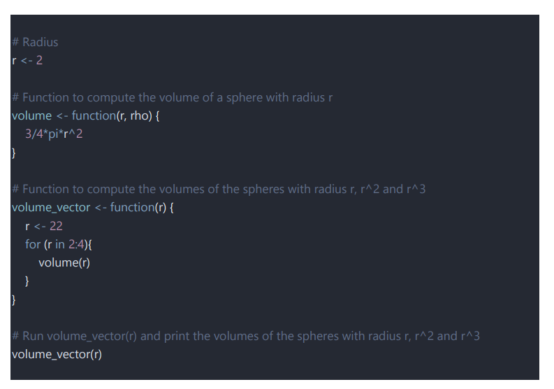

###Practice_04

**This is a practice on debugging a code to print out volume of spheres, code runs fine but there is no values being returned**

Tools used: Debug() and Browser() to check for which line is not returning values

1st problem: rho was a unnecessary argument in the first function
2nd problem: Volume formula was wrong
3rd problem: the range inside the for loop of the 2nd function was wrong and r as the argument is not great
4th problem: declaring r<-22 is redundant as r is being declared as 2 from the start so it becomes global while r<-22 is local. Calling volume_vector(r) is simply recalling r<-2 instead of r<-22

So radius being 2 is interpreted as the intended value.

